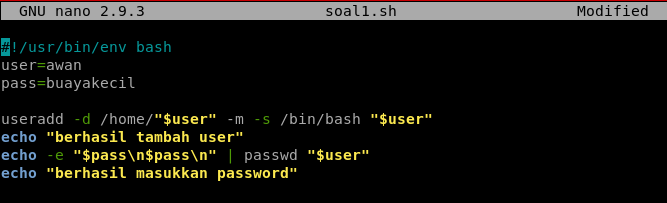
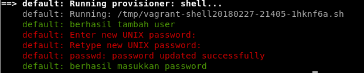
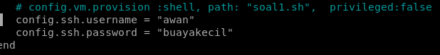
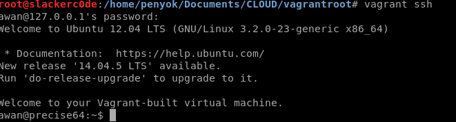

## **Tugas Sesi Lab Modul 1**
### Soal & Jawaban:
1. Buat vagrant virtualbox dan buat user 'awan' dengan password 'buayakecil'.
&nbsp;&nbsp;&nbsp;
Langkah pertama, kami membuat *script bash* yang berisikan *command* dari linux untuk membuat *user* & *password* baru.

&nbsp;&nbsp;&nbsp;
Langkah kedua, kami menambahkan `config.vm.provision :shell, path: "soal1.sh"` pada **Vagrantfile** dan melakukan `vagrant reload --provision`.

&nbsp;&nbsp;&nbsp;
Langkah ketiga, kami menambahkan *config ssh* pada **Vagrantfile** seperti gambar di bawah ini dan melakukan `vagrant reload --provision`.

&nbsp;&nbsp;&nbsp;
Langkah terakhir, kami melakukan *login* dengan menggunakan perintah `vagrant ssh` dan memasukkan password dari user awan. Jika berhasil login akan muncul seperti gambar di bawah ini.

