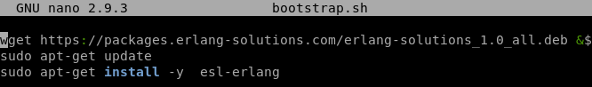
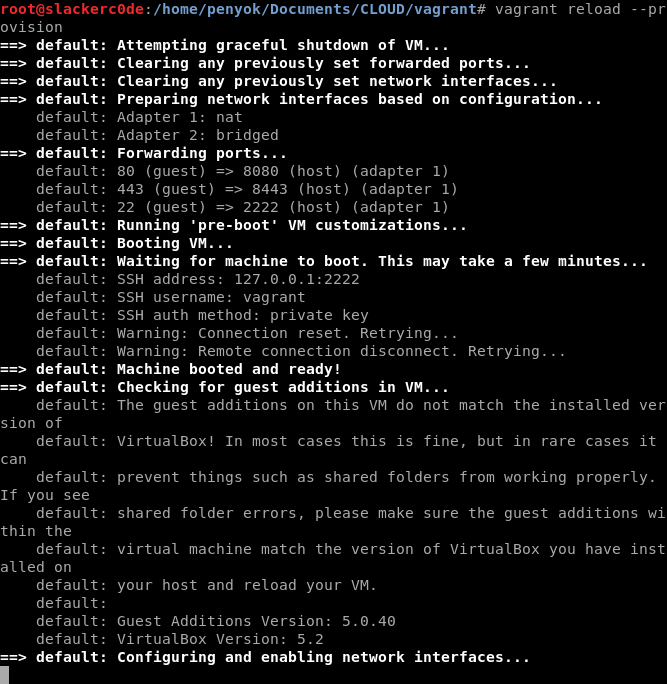
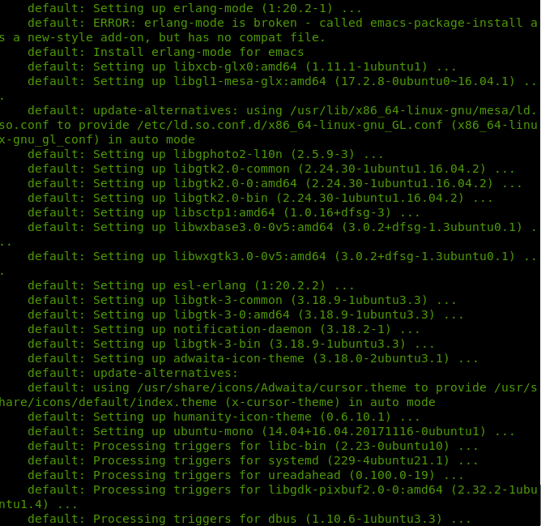
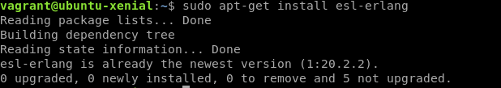
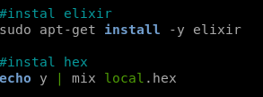
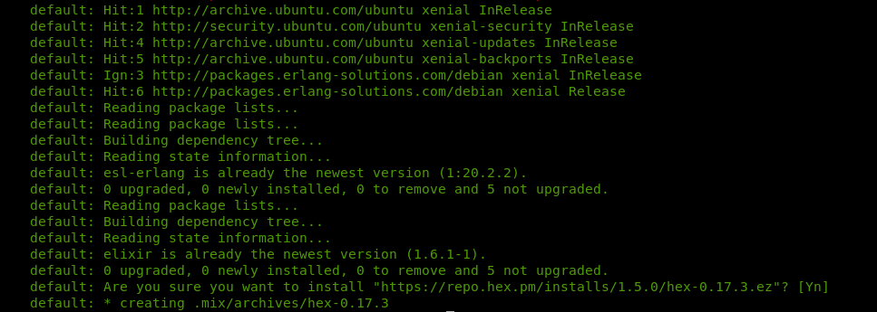
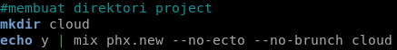
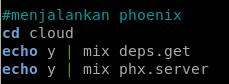
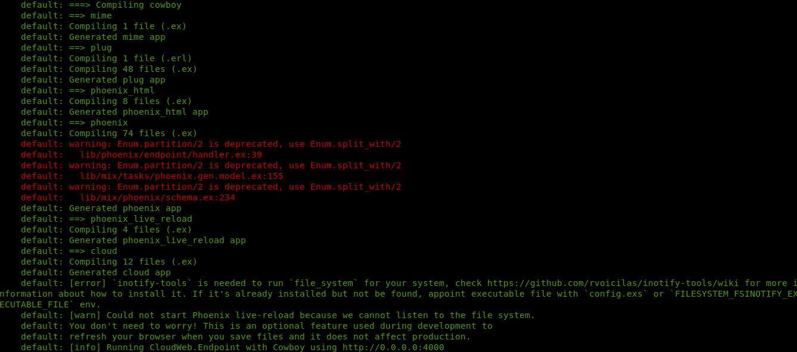
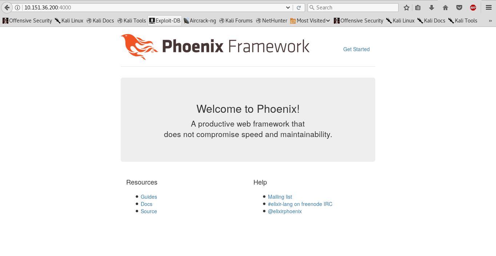

## **Tugas Sesi Lab Modul 1**
### Soal & Jawaban:
2. Buat vagrant virtualbox dan lakukan provisioning install Phoenix Web Framework.
&nbsp;&nbsp;&nbsp;<p>Langkah pertama, kami membuat file **bootstrap.sh** yang isinya adalah seperti gambar di bawah ini.</p>

```bash
#install esl-erlang
wget https://packages.erlang-solutions.com/erlang-solutions_1.0_all.deb && sudo dpkg -i erlang-solutions_1.0_all.deb
sudo apt-get update
sudo apt-get install -y esl-erlang
```
&nbsp;&nbsp;&nbsp;<p>Langkah kedua, kami melakukan `vagrant reload --provision`.</p>

&nbsp;&nbsp;&nbsp;<p>Vagrant melakukan instalasi esl-erlang agar Phoenix Web Framework dapat terinstal.</p>

&nbsp;&nbsp;&nbsp;<p>Langkah ketiga, kami melakukan `vagrant ssh` dan mengecek apakah esl-erlang sudah terinstal di vagrant yang telah kami konfigurasi.</p>

&nbsp;&nbsp;&nbsp;<p>Karena pada ubuntu 16.04 belum ada elixir jadi langkah keempat kami menginstal elixir dan hex juga. Cara menginstalnya kami mengambil referensi dari dokumentasi pada website milik Phoenix Web Framework. Pada file **bootstrap.sh** kami menambahkan beberapa perintah seperti di bawah ini.</p>

```bash
#instal elixir
sudo apt-get install -y elixir

#instal hex
echo y | mix local.hex
```
&nbsp;&nbsp;&nbsp;<p>Langkah kelima, kami melakukan `vagrant reload --provision` lagi. Jika sudah berhasil terinstal, maka akan muncul seperti gambar di bawah ini.</p>

&nbsp;&nbsp;&nbsp;<p>Langkah keenam, kami menambahkan beberapa perintah pada file **bootstrap.sh**.</p>
```bash
#instal phoenix
echo y | mix archive.install https://github.com/phoenixframework/archives/raw/master/phx_new.ez
```
&nbsp;&nbsp;&nbsp;<p>Setelah itu kami melakukan instalasi Phoenix Web Framework dan melakukan `vagrant reload --provision`.</p>

&nbsp;&nbsp;&nbsp;<p>Kami membuat direktori project untuk Phoenix Web Framework.</p>

&nbsp;&nbsp;&nbsp;<p>Setelah kami berhasil membuat direktorinya, langkah selanjutnya adalah menjalankan Phoenix Web Framework dengan beberapa perintah di bawah ini yang telah kami tambahkan juga ke file **bootstrap.sh**.</p>

&nbsp;&nbsp;&nbsp;<p>Pada terminal akan muncul seperti gambar di bawah ini jika Phoenix Web Framework telah berhasil dijalankan.</p>

&nbsp;&nbsp;&nbsp;<p>Atau bisa langsung diakses melalui browser dengan menggunakan `http://`**[IP_Vagrant]**`:4000`, misal seperti gambar di bawah ini.</p>
