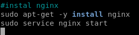

## **Tugas Sesi Lab Modul 1**
### Soal & Jawaban:
3. Buat vagrant virtualbox dan lakukan provisioning install:
- php
- mysql
- composer
- nginx
&nbsp;&nbsp;&nbsp;&nbsp;&nbsp;&nbsp;<p>setelah melakukan provioning, clone https://github.com/fathoniadi/pelatihan-laravel.git pada folder yang sama dengan vagrantfile di komputer host. Setelah itu sinkronisasi folder pelatihan-laravel host ke vagrant ke **/var/www/web** dan jangan lupa install vendor laravel agar dapat dijalankan. Setelah itu setting root document nginx ke **/var/www/web**. webserver VM harus dapat diakses pada port 8080 komputer host dan mysql pada vm dapat diakses pada port 6969 komputer host.</p>
&nbsp;&nbsp;&nbsp;<p>Langkah pertama, kami membuat file **soal3.sh** yang isinya adalah seperti gambar di bawah ini.</p>

&nbsp;&nbsp;&nbsp;<p>Perintah-perintah diatas untuk menginstal **php**.</p>
&nbsp;&nbsp;&nbsp;<p>Langkah kedua, kami menambahkan beberapa perintah untuk mengatur mysql dan sekaligus menginstal **mysql-server** dan **mysql-client**.</p>

&nbsp;&nbsp;&nbsp;<p>Langkah ketiga, kami menambahkan beberapa perintah untuk mengatur mysql agar **host** dapat mengakses **mysql** pada **virtual machine**.</p>

&nbsp;&nbsp;&nbsp;<p>Langkah ke empat, kami menambahkan beberapa perintah untuk menginstal **composer** pada **virtual machine**.</p>

&nbsp;&nbsp;&nbsp;<p>Langkah ke lima, kami menambahkan beberapa perintah untuk menginstal **nginx** pada **virtual machine**.</p>

&nbsp;&nbsp;&nbsp;<p>Jika digabungkan keseluruhan file **soal3.sh**-nya sebagai berikut:</p>
```bash
#instal php dengan menambahkan repositori juga
sudo apt-get -y update
sudo apt-get install -y software-properties-common build-essential
sudo add-apt-repository ppa:ondrej/php
sudo apt-get -y update
sudo apt-get install -y php7.1 php7.1-cli php7.1-common php7.1-json php7.1-opcache php7.1-mysql php7.1-mbstring php7.1-mcrypt php7.1-zip php7.1-fpm

#setting mysql (username: root) ~ (password: cloud)
sudo debconf-set-selections <<< 'mysql-server-5.6 mysql-server/root_password password cloud'
sudo debconf-set-selections <<< 'mysql-server-5.6 mysql-server/root_password_again password cloud'

#instal mysql
sudo apt-get install -y mysql-server
sudo apt-get install -y mysql-client

#mengatur database
mysql -u root -p cloud -e "CREATE DATABASE IF NOT EXISTS $APP_DATABASE_NAME;";
mysql -u root -p cloud -e "GRANT ALL PRIVILEGES ON *.* TO 'root'@'%' IDENTIFIED BY 'cloud';"
mysql -u root -p cloud -e "GRANT ALL PRIVILEGES ON *.* TO 'root'@'localhost' IDENTIFIED BY 'cloud';"
sudo service mysql restart

#instal composer
php -r "copy('https://getcomposer.org/installer', 'composer-setup.php');"
php -r "if (hash_file('SHA384', 'composer-setup.php') === '544e09ee996cdf60ece3804abc52599c22b1f40f4323403c44d44fdfdd586475ca9813a858088ffbc1f233e9b180f061') { echo 'Installer verified'; } else { echo 'Installer corrupt'; unlink('composer-setup.php'); } echo PHP_EOL;"
php composer-setup.php
php -r "unlink('composer-setup.php');"
mv composer.phar /usr/local/bin/composer

#instal nginx
sudo apt-get -y install nginx
sudo service nginx start
```
&nbsp;&nbsp;&nbsp;<p>Langkah ke 6, kami melakukan **clone git pelatihan laravel**.</p>
```bash
git clone https://github.com/fathoniadi/pelatihan-laravel.git
cd pelatihan-laravel
cp .env.example .env
sudo composer update
php artisan key:generate
php artisan migrate
php artisan db:seed
```
&nbsp;&nbsp;&nbsp;<p>Langkah ke 7, kami melakukan perubahan pada **Vagrantfile** agar folder **host** tersinkronisasi dengan **virtual machine**.</p>

&nbsp;&nbsp;&nbsp;<p>Kegunaan perintah-perintah di atas antara lain untuk merubah kepemilikan, grup, dan hak akses.</p>
&nbsp;&nbsp;&nbsp;<p>Langkah ke 8, kami melakukan perubahan pada **Vagrantfile** agar **web server** pada **virtual machine** harus dapat diakses pada **port 8080** komputer **host** dan **mysql** pada **virtual machine** harus dapat diakses pada **port 6969** komputer **host**.</p>

&nbsp;&nbsp;&nbsp;<p>Langkah ke 9, kami melakukan perubahan pada file **/etc/nginx/sites-available/default** menjadi:</p>
```bash
server {
    # Server listening port
    listen 80;

    # Server domain or IP
    server_name localhost;

    # Root and index files
    root /var/www/web/public;
    index index.php index.html index.htm;

    # Urls to attemp
    location / {
        try_files $uri $uri/ /index.php?$query_string;
    }

    # Configure PHP FPM
    location ~* \.php$ {
        fastcgi_pass unix:/var/run/php/php7.2-fpm.sock;
        fastcgi_index index.php;
        fastcgi_split_path_info ^(.+\.php)(.*)$;
        fastcgi_params SCRIPT_FILENAME $document_root$fastcgi_script_name;
        include /etc/nginx/fastcgi_params;
    }
}
```
&nbsp;&nbsp;&nbsp;<p>Langkah ke 10, kami mematikan **apache2** karena secara *default service*nya sudah aktif.</p>
`sudo service apache2 stop`
&nbsp;&nbsp;&nbsp;<p>Lalu diikuti dengan me*restart* **nginx** dan **php7.2-fpm**.</p>
```bash
sudo service nginx restart
sudo service php7.1-fpm restart
```
&nbsp;&nbsp;&nbsp;**Tambahan**:
&nbsp;&nbsp;&nbsp;<p>Jika ingin me*remote* **mysql** harus menggunakan perintah di bawah ini:</p>
```bash
sed -i '\s/.*/bind-address  = 0.0.0.0/' /etc/mysql/mysql.conf.d/mysqld.cnf
service mysql restart
```
