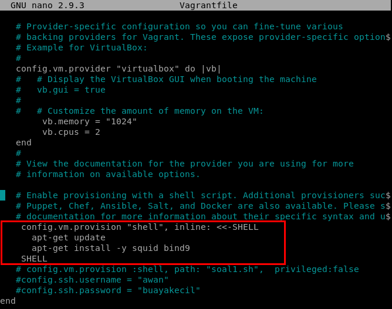
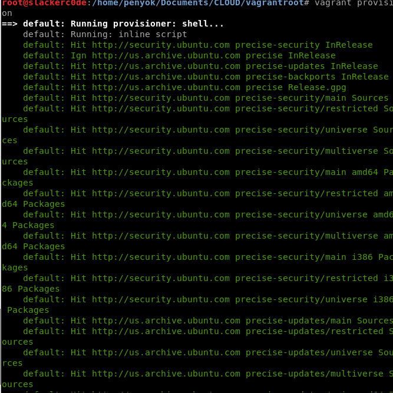
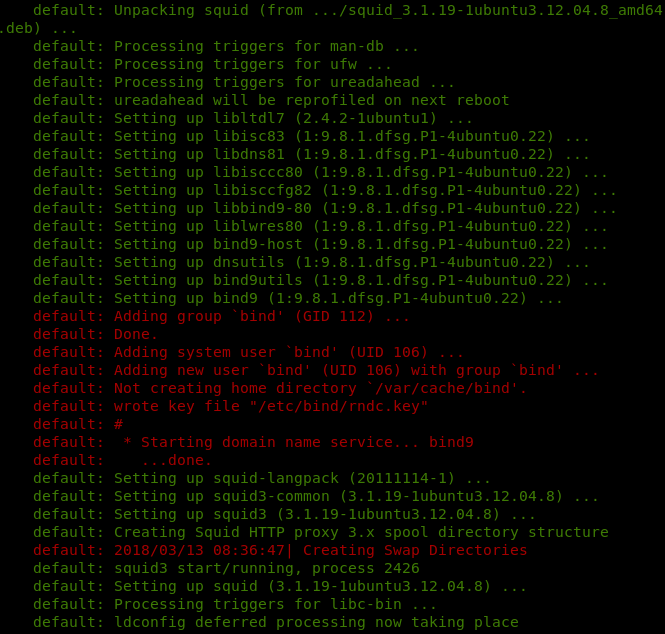
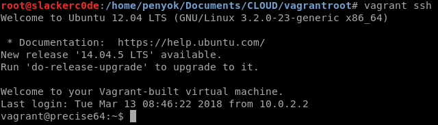
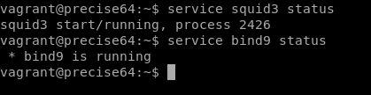

## **Tugas Sesi Lab Modul 1**
### Soal & Jawaban:
4. Buat vagrant virtualbox dan lakukan provisioning install:
- Squid proxy
- Bind9
&nbsp;&nbsp;&nbsp;
Langkah pertama, kami mengubah **Vagrantfile** seperti gambar di bawah ini. Bagian yang dirubah adalah bagian yang di dalam kotak merah.

&nbsp;&nbsp;&nbsp;
Langkah kedua, kami melakukan `vagrant provision`. Gambar di bawah ini menunjukkan apabila vagrant menjalankan `apt-get update`.

&nbsp;&nbsp;&nbsp;
Vagrant menjalankan `apt-get install -y squid bind9` agar squid proxy dan bind9 terinstal.

&nbsp;&nbsp;&nbsp;
Langkah ketiga, kami melakukan `vagrant ssh`.

&nbsp;&nbsp;&nbsp;
Langkah terakhir, kami melakukan pengecekan apakah squid proxy dan bind9 sudah terinstal pada vagrant. Pengecekan tersebut dengan cara mengetikkan `service squid3 status` dan `service bind9 status`.

