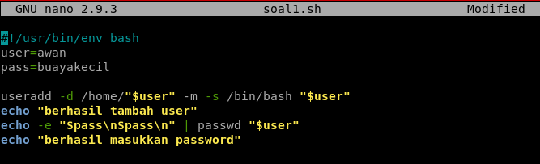
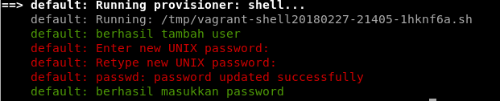
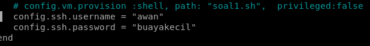
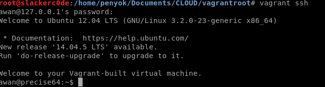

## **Tugas Sesi Lab Modul 1**
### Soal & Jawaban:
1. Buat vagrant virtualbox dan buat user 'awan' dengan password 'buayakecil'.
&nbsp;&nbsp;&nbsp;
Langkah pertama, kami membuat *script bash* yang berisikan *command* dari linux untuk membuat *user* & *password* baru.

&nbsp;&nbsp;&nbsp;
Langkah kedua, kami menambahkan `config.vm.provision :shell, path: "soal1.sh"` pada **Vagrantfile** dan melakukan `vagrant reload --provision`.

&nbsp;&nbsp;&nbsp;
Langkah ketiga, kami menambahkan *config ssh* pada **Vagrantfile** seperti gambar di bawah ini dan melakukan `vagrant reload --provision`.

&nbsp;&nbsp;&nbsp;
Langkah terakhir, kami melakukan *login* dengan menggunakan perintah `vagrant ssh` dan memasukkan password dari user awan. Jika berhasil login akan muncul seperti gambar di bawah ini.

2. Buat vagrant virtualbox dan lakukan provisioning install Phoenix Web Framework.
3. Buat vagrant virtualbox dan lakukan provisioning install:
- php
- mysql
- composer
- nginx
&nbsp;&nbsp;&nbsp;&nbsp;&nbsp;&nbsp;
setelah melakukan provioning, clone https://github.com/fathoniadi/pelatihan-laravel.git pada folder yang sama dengan vagrantfile di komputer host. Setelah itu sinkronisasi folder pelatihan-laravel host ke vagrant ke **/var/www/web** dan jangan lupa install vendor laravel agar dapat dijalankan. Setelah itu setting root document nginx ke **/var/www/web**. webserver VM harus dapat diakses pada port 8080 komputer host dan mysql pada vm dapat diakses pada port 6969 komputer host.

4. Buat vagrant virtualbox dan lakukan provisioning install:
- Squid proxy
- Bind9
