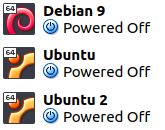
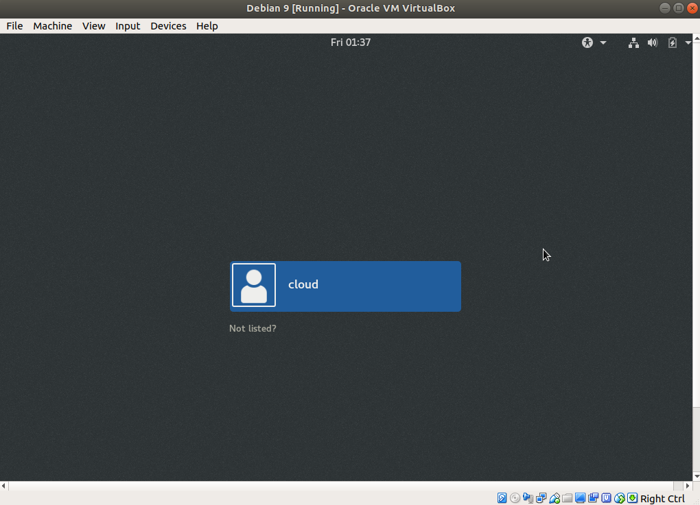
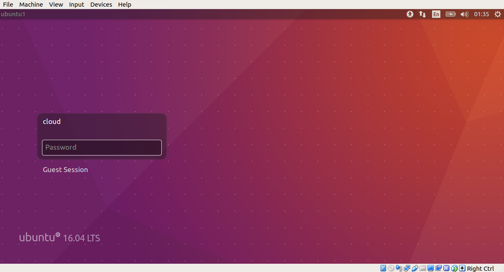

## **Tugas Sesi Lab Modul 3**
### Soal :
1. Buat 3 VM, 2 Ubuntu 16.04 sebagai worker, 1 Debian 9 sebagai DB server 
### Jawab :
&nbsp;&nbsp;&nbsp;
Kami menggunakan aplikasi Virtual Box untuk membuat 3 VM tersebut, 2 Ubuntu 16.04 sebagai worker, 1 Debian 9 sebagai DB server.

 
&nbsp;&nbsp;&nbsp;Tampilan Debian 9: 

&nbsp;&nbsp;&nbsp;Tampilan Ubuntu 16.04: 

