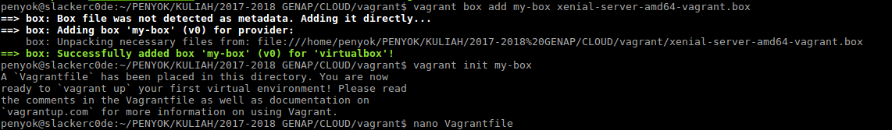
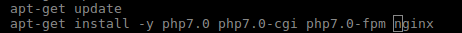
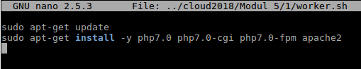

## **Tugas Sesi Lab Modul 5**
### Soal :
1. Buatlah Vagrantfile sekaligus provisioning-nya untuk menyelesaikan kasus tersebut.<br>
### Jawab :
&nbsp;&nbsp;&nbsp;<p>Ketentuan IP pada VM:</p>
- IP Load Blancer = 192.168.1.2 <br>
- IP Worker 1 = 192.168.1.3 <br>
- IP Worker 2 = 192.168.1.4 <br>

&nbsp;&nbsp;&nbsp;<p>Berikut langkah-langkah untuk menjawab soal nomor 1 :</p>
1. Karena vagrant box yang kami gunakan adalah ubuntu/xenial64 dan file tersebut kami download manual, jadi kami harus menambahkan file tersebut secara manual juga dengan cara seperti dibawah ini.
<br>
2. Sebelum melakukan `vagrant up`, kami melakukan beberapa perubahan konfigurasi pada **Vagrantfile** seperti file [berikut](Vagrantfile).<br>
3. Kami membuat file [lb.sh](lb.sh) untuk instalasi aplikasi pada Load Balancer. Isi scriptnya seperti gambar dibawah ini.
<br>
4. Kami membuat file [worker.sh](worker.sh) untuk instalasi aplikasi pada Worker. Isi scriptnya seperti gambar dibawah ini.
<br>
5. Kami mengubah file konfigurasi nginx pada load balancer: `/etc/nginx/sites-available/default`
```shell
server {
        listen 80 default_server;
        listen [::]:80 default_server;

        root /var/www/html;

        index index.php index.html index.htm index.nginx-debian.html;

        server_name _;

        location / {
                # First attempt to serve request as file, then
                # as directory, then fall back to displaying a 404.
                try_files $uri $uri/ =404;
                proxy_pass http://worker;
        }

        location ~ \.php$ {
            include snippets/fastcgi-php.conf;
            fastcgi_pass 127.0.0.1:9000;

        }

        location ~ /\.ht {
                deny all;
        }
}
```
6. 3 Konfigurasi nginx pada load balancer sesuai kasus pada soal adalah sebagai berikut:
- Algoritma **Round-Robin**
```shell
upstream worker {
   server 192.168.1.3;
   server 192.168.1.4;
}
```
- Algoritma **Least Connections**
```shell
upstream worker {
   least_conn;
   server 192.168.1.3;
   server 192.168.1.4;
}
```
- Algoritma **IP Hash**
```shell
upstream worker {
   ip_hash;
   server 192.168.1.3;
   server 192.168.1.4;
}
```
7. Kami melakukan restart pada nginx dengan menjalankan perintah `sudo service nginx restart`
8. Kami melakukan perubahan pada konfigurasi **php-fpm** pada worker 1 & 2 yang berada pada `/etc/php/7.0/fpm/pool.d/www.conf`
```shell
 dari :
 	listen = /run/php/php7.0-fpm.sock
 
 menjadi :
 	listen = 9000
```
9. Kami melakukan restart pada php-fpm dengan menjalankan perintah `sudo service php7.0-fpm restart`